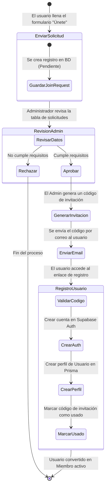
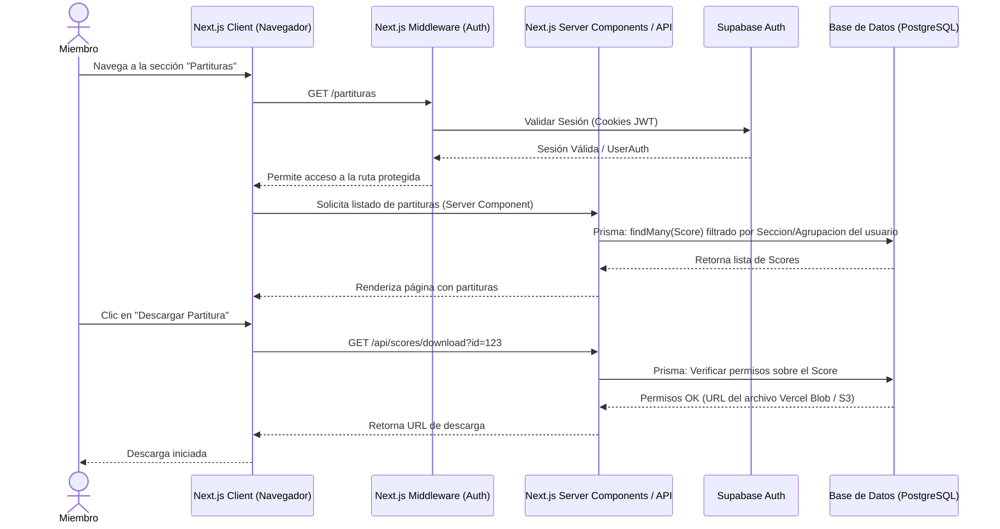
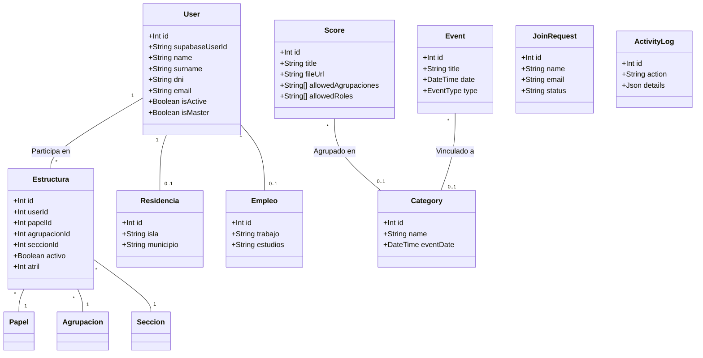
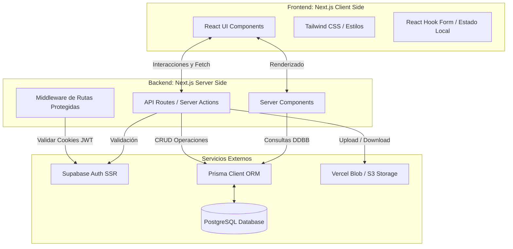

# Análisis UML: Aplicación Web OCGC

A continuación se presentan los diferentes diagramas UML solicitados, generados tras analizar la arquitectura de la aplicación Next.js, su base de datos (Prisma) y sus integraciones (Supabase).

## 1. Diagrama de Casos de Uso
Este diagrama ilustra las interacciones principales de los diferentes actores (Usuario Público, Miembro y Administrador) con el sistema.

```mermaid
flowchart TD
    %% Actors
    Public["Usuario Público"]
    Member["Miembro"]
    Admin["Administrador"]
    Archiver["Archivero"]
    SectionLeader["Jefe de Sección"]
    Seller["Vendedor"]

    subgraph PublicPortal [Portal Público]
        UC1["Consultar Conciertos"]
        UC2["Ver Información"]
        UC3["Enviar Solicitud de Ingreso"]
    end

    subgraph MemberPortal [Portal de Miembros]
        UC4["Iniciar Sesión"]
        UC5["Recuperar Contraseña"]
        UC6["Ver Perfil"]
        UC7["Descargar Partituras"]
    end

    subgraph AdminPortal [Portal Administrativo / Gestión]
        UC8["Gestionar Miembros"]
        UC9["Gestionar Solicitudes"]
        UC10["Gestionar Catálogo de Partituras"]
        UC11["Administrar Eventos"]
        UC12["Generar Códigos de Invitación"]
        UC13["Ver Logs de Actividad"]
        UC14["Gestionar Ventas / Entradas"]
        UC15["Gestionar Personal de Sección"]
    end

    %% Relations
    Public --> UC1
    Public --> UC2
    Public --> UC3

    Member --> UC4
    Member --> UC5
    Member --> UC6
    Member --> UC7

    Admin --> UC4
    Admin --> UC8
    Admin --> UC9
    Admin --> UC10
    Admin --> UC11
    Admin --> UC12
    Admin --> UC13
    Admin --> UC14

    Archiver --> UC6
    Archiver --> UC7
    Archiver --> UC10

    SectionLeader --> UC6
    SectionLeader --> UC15

    Seller --> UC6
    Seller --> UC14
```

## 2. Diagrama de Procesos (Actividad)
Este diagrama detalla el flujo o proceso de admisión de nuevos miembros, desde que envían la solicitud hasta que completan su registro.

## 3. Diagrama de Secuencia
Este diagrama muestra la secuencia de operaciones cuando un miembro autenticado solicita ver y descargar una partitura.

## 4. Diagrama de Clases (Modelo de Datos)
Basado en el esquema de Prisma (`schema.prisma`), este diagrama representa las principales entidades y sus relaciones estructurales en la base de datos relacional.

## 5. Diagrama de Componentes
Muestra la arquitectura de alto nivel de la aplicación Web, estructurada bajo el paradigma de Next.js (App Router), la capa de autenticación y la gestión de datos.

